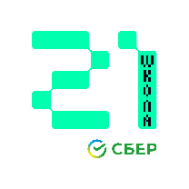

<h1 align="center">Hi everyone 👋, I'm Michael (Gromynyrg)</h1>

  

  
  
  

---

### 👨‍💻 About Me & Focus

* 🏗️ **Currently building:** An automated management system for engineering surveys at **LEOTERRA** , and an NLP-driven medical startup for automated patient routing.
* 🚀 **Tech interests:** High-load backend infrastructure, async databases, and scalable microservices.
* 🧠 **Core Expertise:** Microservices, asynchronous task processing (RabbitMQ, Celery), caching (Redis), and advanced database design (PostgreSQL / JSONB).
* 🌍 **Bonus:** Strong background in spatial data and Geographic Information Systems (GIS).

---

### 🛠️ Tech Stack

**Backend & Architecture:**

  

**Databases, Brokers & DevOps:**

  

**Frontend (Fullstack tasks):**

  

---

### 🎓 Education & Achievements

* 🎓 **MIPT (Moscow Institute of Physics and Technology):** Master's in IT Product Development (Graduation: June 2026). *Thesis: NLP system for patient history collection.* 
* 💻 **School 21 (by Sber):** Algorithms and Systems Programming (C/C++). 
* 🌍 **MGRI:** Bachelor's degree in Geographic Information Systems (GIS). 

---

### 🏆 Algorithms & Coding Stats

  
  

